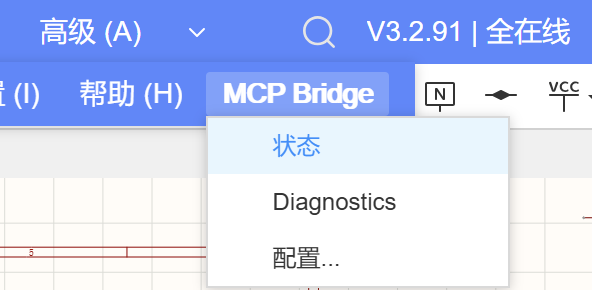
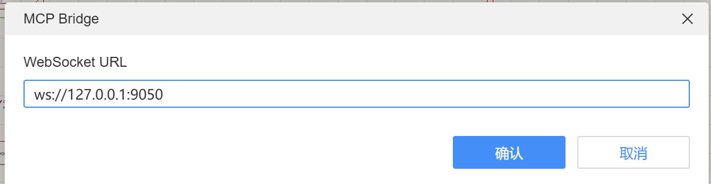
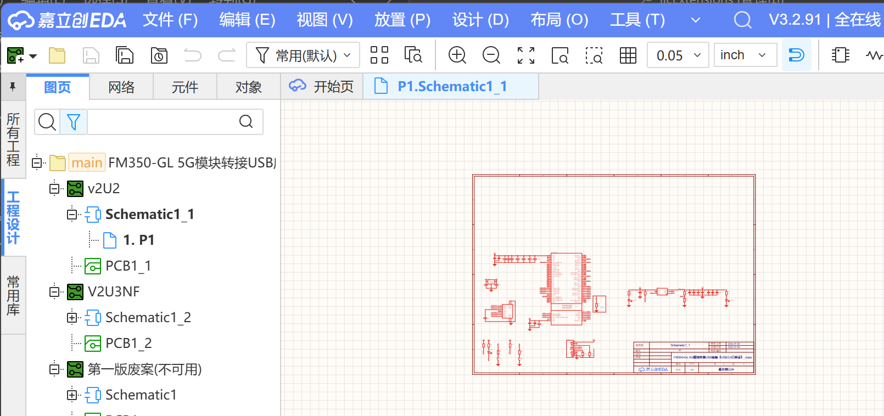
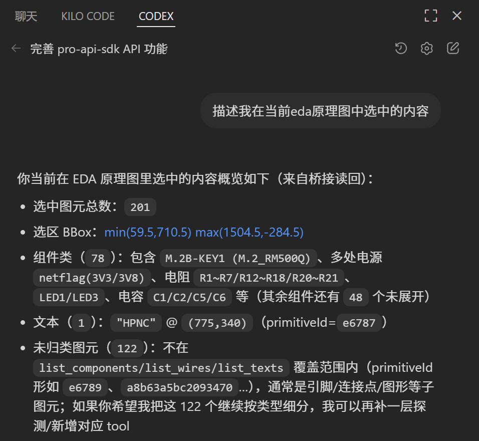

# JLCEDA MCP Bridge（EDA Extension）

本项目是运行在 **嘉立创 EDA Pro 本地客户端** 内的扩展：`jlceda-mcp-bridge`。  
它的作用是把 EDA 内部的 `globalThis.eda.*` 能力，通过 **WebSocket RPC** 暴露给外部自动化工具（如 Codex、OpenClaw 等），用于读取/编辑/导出工程并支持脚本化操作。  
（历史配套的 `packages/mcp-server` 已弃用，见文末备注。）
## 演示



使用时请先：  
```  
git clone --depth=1 https://github.com/XuF163/jlc-eda-mcp
cd jlc-eda-mcp
cd docs
```  
帮助ai通过阅读skills快速学会操作嘉立创eda
插件扩展会在打开工程时候自动启动：  

选中原理图对象
 
我用的vscode中的codex插件，原理图读取功能展示如下：



强大的原理图精确编辑能力：


如果不喜欢用codex用openclaw也是可以的，无需单独配置mcp，直接通过skills强力驱动

## 快速上手
1.安装本插件
2.扩展管理器-配置 开启外部交互能力

3.启动ai工具

## 扩展提供的能力（这部分供LLM读取）

扩展侧对外暴露的 RPC 方法清单在：

- `jlc-eda-mcp/docs/EDA_EXTENSION_RPC.md`

按能力域概览如下（更细的参数/返回与示例见上面的清单）：

### 1) 基础 / 状态

- `ping`：连通性检查
- `showMessage`：在 EDA 内显示 toast（best-effort）
- `getStatus`：扩展侧桥接状态快照（连接状态、最近错误、serverUrl 等）

### 2) 文档 / 视图 / 导出

- `getCurrentDocumentInfo`：当前焦点文档信息
- `ensureSchematicPage`：确保打开并聚焦原理图图页（必要时自动创建）
- `captureRenderedAreaImage`：抓取当前渲染区域 PNG（可保存到文件系统或触发下载）
- `exportDocumentFile`：导出当前文档 `.epro2/.epro`
- `getDocumentSource`：读取文档源码（可截断）
- `exportSchematicNetlistFile` / `schematic.getNetlist`：导出/读取网表

### 3) 器件库

- `library.searchDevices`：按关键字搜索器件库
- `library.getDevice`：读取器件详情

### 4) 原理图编辑（低阶）

- `schematic.placeDevice`：放置器件
- `schematic.getComponentPins`：读取器件引脚（坐标/编号/名称）
- `schematic.connectPins`：两引脚自动连线（Manhattan / straight）
- `schematic.createWire`：按坐标创建导线
- `schematic.drc` / `schematic.save`：DRC 与保存

### 5) 原理图 IR（高阶绘图）

- `schematic.applyIr`：接收 `SchematicIR v1` 并做 **增量 upsert**（适合 LLM 批量绘图/迭代修改）
  - IR 规范：`jlc-eda-mcp/docs/SCHEMATIC_IR.md`
  - 入口实现：`src/handlers/applyIr.ts`

### 6) Inspect / 选择 / 调试

- `schematic.listComponents / listWires / listTexts`
- `schematic.findByDesignator`
- `schematic.selectPrimitives / schematic.crossProbeSelect / schematic.clearSelection`
- `schematic.zoomToAll`
- `schematic.indicator.show / schematic.indicator.clear`

### 7) 全量 EDA API 透传（高级/危险）

- `eda.keys / eda.get / eda.invoke`：按字符串路径反射访问 `globalThis.eda.*`

限制与注意：

- 仅支持 **JSON 可序列化** 参数与返回（结果会做 json-safe 截断/去环）
- 无法跨桥传函数/回调，因此“事件监听/回调注册”类 API 不适用
- 路径只支持点号分段，且禁止 `__proto__/prototype/constructor`

## 使用方法（安装与联调）

完整端到端的安装/启动流程请优先看：`jlc-eda-mcp/docs/SETUP.md`。  
这里给出扩展侧的最小流程说明。

### 1) 构建扩展包（生成 `.eext`）

在仓库根目录（`jlc-eda-mcp`）：

```bash
npm -w packages/eda-extension run build
```

生成产物目录：

- `packages/eda-extension/build/dist/`

文件名形如：

- `jlceda-mcp-bridge_v0.0.13.eext`

> 版本号来自 `extension.json` 的 `version` 字段。

### 2) 安装到 JLCEDA Pro

在嘉立创 EDA Pro 客户端中打开扩展管理器：

- 安装本地扩展：选择上一步生成的 `.eext`
- 启用扩展（必要时勾选“显示在顶部菜单”）
- 重启 EDA（部分版本需要重启才刷新顶部菜单）

安装成功后，顶部菜单会出现：

- `MCP Bridge -> Status / Diagnostics / Configure...`

### 3) 在 EDA 里配置并连接

在 EDA 顶部菜单：

- `MCP Bridge -> Configure...`：填写 WebSocket URL（例：`ws://127.0.0.1:9050`）

当前版本扩展默认 **自动连接**（activationEvents：`onStartupFinished/onEditorSchematic`），通常不需要手动点 Connect。

> 注意：需要本机有可连接的 WebSocket Bridge 服务（具体启动方式见 `jlc-eda-mcp/docs/SETUP.md`）。

连接后可通过：

- `MCP Bridge -> Status` 查看连接状态
- `MCP Bridge -> Diagnostics` 查看更详细信息（含 debugLog、最近错误、EDA 版本等）

## 常见问题（Troubleshooting）

### 1) Status 显示未连接 / 一直 reconnect

- 确认本机 WebSocket Bridge 服务在运行，并监听到正确端口
- 确认 `Configure...` 里填写的 URL 正确（例如 `ws://127.0.0.1:9050`）
- 检查扩展权限（见 `jlc-eda-mcp/docs/SETUP.md` 的权限提示）

### 2) 顶部菜单没有出现 `MCP Bridge`

- 检查扩展管理器里是否启用该扩展，并勾选“显示在顶部菜单”
- 重启 EDA 客户端

### 3) 导出/保存失败（`EXPORT_FAILED` / `SAVE_FILE_FAILED`）

常见原因是扩展缺少文件系统相关权限或路径不可写：

- `SYS_FileSystem.*`
- `SYS_FileManager.getDocumentFile`

### 4) 原理图方法报 `NOT_IN_SCHEMATIC_PAGE`

很多原理图 API 需要当前焦点文档是原理图页。可先调用：

- `ensureSchematicPage`（RPC）或 `jlc.schematic.ensure_page`（tool）

## 开发与代码入口

- 扩展入口：`src/index.ts`
- RPC 路由：`src/handlers/index.ts`
- EDA 全量 API 透传：`src/handlers/edaApi.ts`
- 打包脚本：`build/packaged.ts`（读取 `.edaignore`，生成 `.eext`）

本包脚本（见 `package.json`）：

- `npm -w packages/eda-extension run compile`：esbuild 编译到 `dist/`
- `npm -w packages/eda-extension run build`：编译 + 打包 `.eext`
- `npm -w packages/eda-extension run typecheck`：tsc 类型检查
  
开源地址：https://github.com/XuF163/jlc-eda-mcp

## 备注：`packages/mcp-server` 已弃用

`packages/mcp-server` 属于早期桥接实现，现已不再推荐使用：

- 链路长（WS/MCP/HTTP 多层封装），端到端效率低、延迟高
- 组件多、耦合重，调试与排错成本高
- 维护成本高（协议/工具链变化频繁，兼容性压力大）
