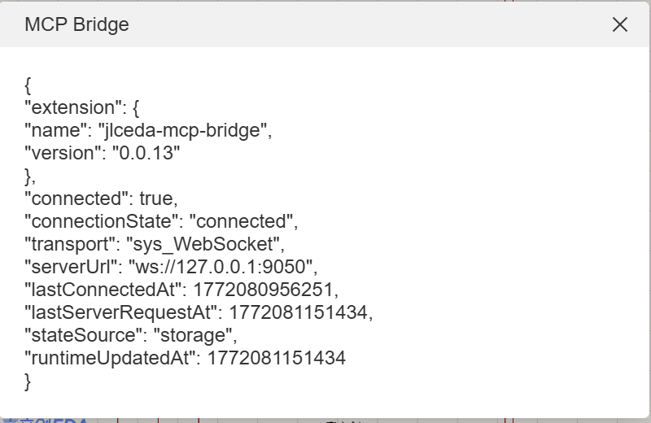
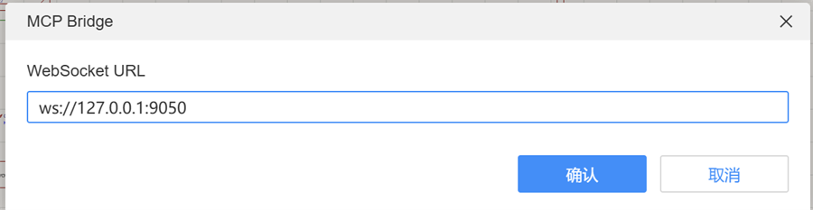
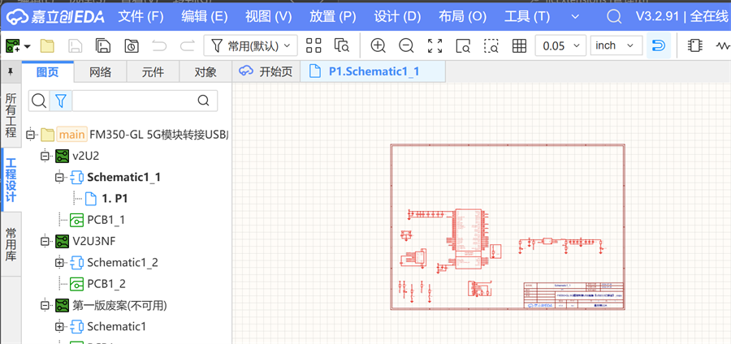
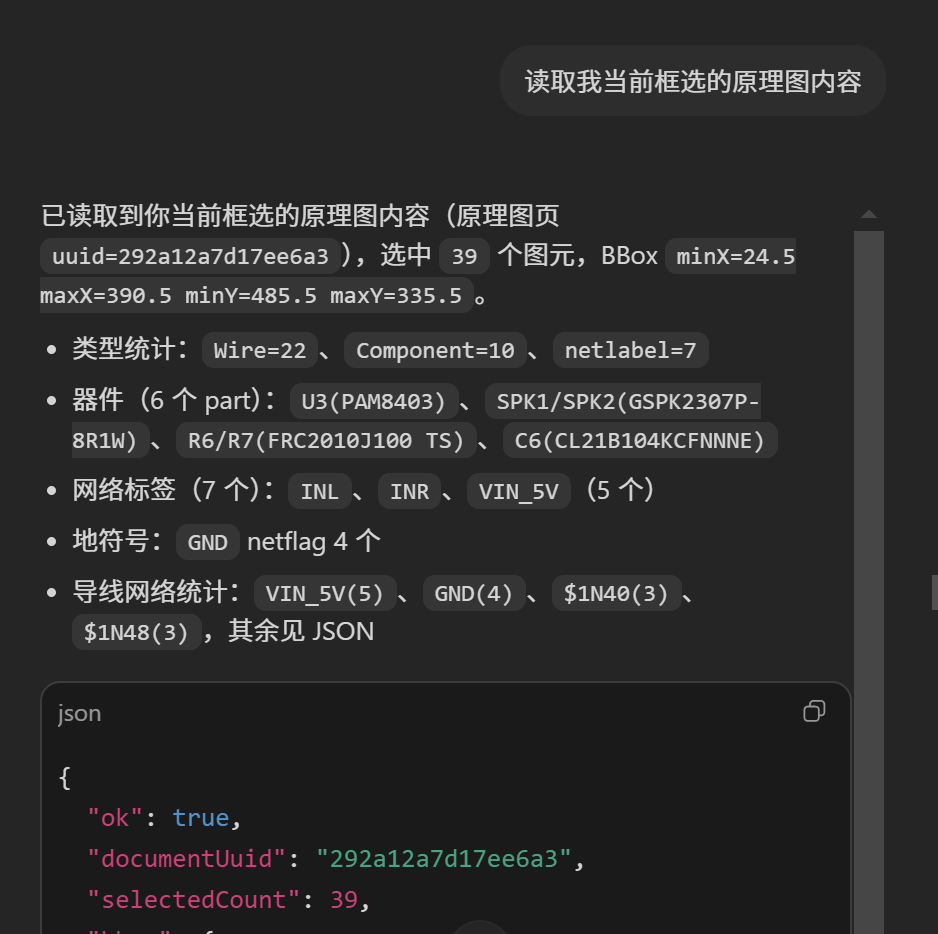
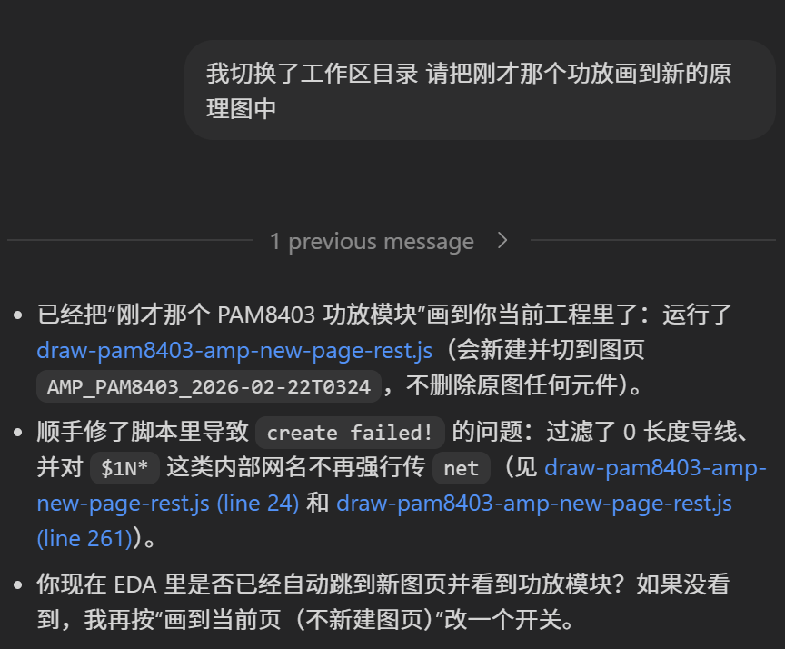
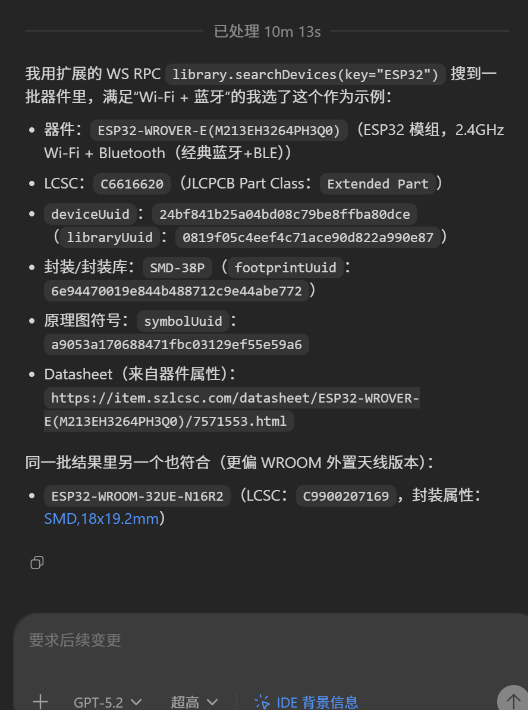
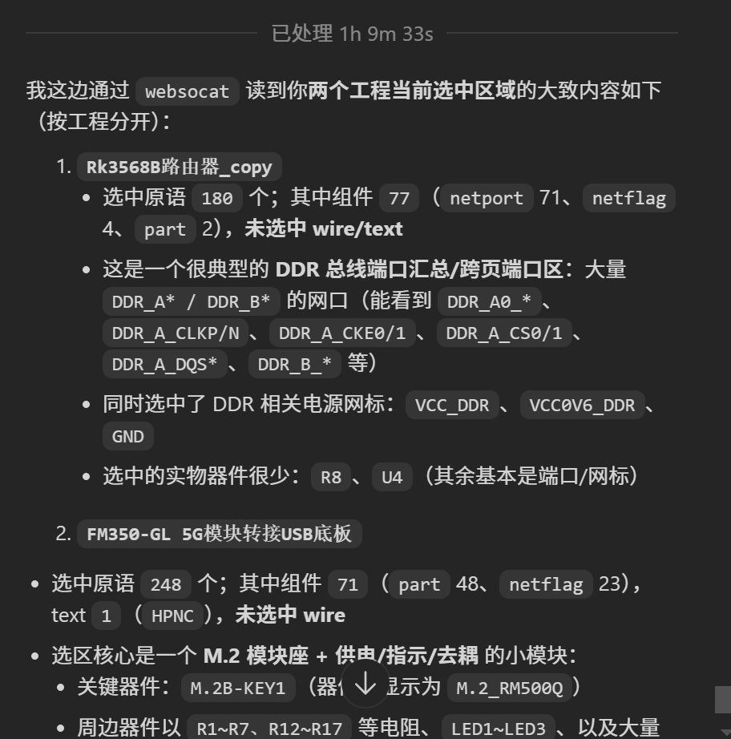
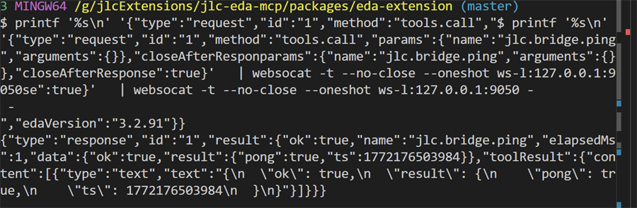
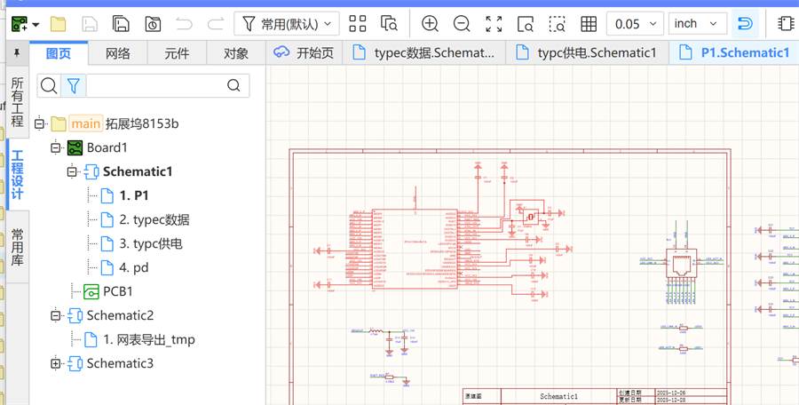
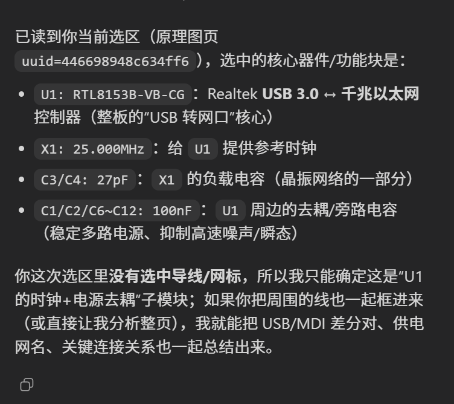

## JLCEDA  Bridge Extension

本项目是运行在 **嘉立创 EDA Pro 本地客户端** 内的扩展，将 EDA 内部的 `globalThis.eda.*` 能力，通过 **WebSocket RPC** 暴露给外部自动化工具（如 Codex、OpenClaw 等），用于读取/编辑/导出工程并支持脚本化操作。  
考虑到纯 MCP 方案使用时的诸多不便，`packages/mcp-server` 已计划废弃；现转向 “websocat + skills 文档” 的方式驱动。  

---
[免责声明]如需使用本扩展 请自行做好项目文件备份工作，强烈建议使用沙箱操作，由于AI能力问题导致的删库、软件崩溃等问题，本人概不负责；强烈不建议使用上下文短、幻觉强且不负责任的模型，目前所有LLM均可能存在幻觉，并在长上下文窗口工作时可能产生效率低下、信息丢失甚至严重的错误

## 项目用途  
便于用户复用现有便宜大碗的各类coding plan对EDA软件进行操作，无需为价格昂贵的apikey额外付费，更无需面对各类订阅2api项目导致的账号封禁风险

## 环境准备

使用您喜爱的包管理器安装 websocat：
```
# 使用 cargo 安装，cargo是Rust的包管理器，如您本地已经安装Rust开发环境，请使用此命令
cargo install websocat
# 使用 Homebrew 安装，如您使用Mac，请使用此命令 
brew install websocat
```  
如不使用包管理器，也可自行下载二进制并添加到环境变量  
即便在windows系统上，本人也推荐使用git bash作为终端供LLM使用，部分模型在powershell下可能表现不佳，本人已多次遭遇删库

安装验证：终端输入 websocat --version应显示有版本号


## 演示




（非必选 直接发文档地址也可)用时请先：  
```  
git clone --depth=1 https://github.com/XuF163/jlc-eda-mcp
cd jlc-eda-mcp

```  
推荐 AI 通过阅读 skills 以及 项目完整代码 了解本项目，快速学会操作嘉立创 EDA：

- 新接入/零上下文：`docs/welcome_new_agent.md`
- `skills/jlceda-eda-rest/SKILL.md`

插件扩展会在打开工程时候自动启动：    

选中原理图对象


我用的vscode中的codex插件，原理图读取功能展示如下：  



强大的原理图精确编辑能力：

在立创商城进行元件选型：

在多个项目中使用：  

如果不喜欢用codex用openclaw也是可以的，无需单独配置mcp，直接通过skills强力驱动

## 快速上手
>警告：请在测试环境中使用，用于生产环境造成的一切后果自负，如有异议，请联系模型提供方
1) 安装本插件
2) 扩展管理器 -> 配置：开启外部交互能力（否则 WS/文件导出等会失败）

3) `MCP Bridge -> Configure...`：已预填写 `ws://127.0.0.1:9050`
   - 多窗口/多工程：保持端口在 `9050-9059` 范围内即可；扩展会自动协商一个可用端口（每个工程窗口一个端口），并在 `hello`/`Status` 中显示
4) 用 `websocat` 一次性验证（扩展回包后会主动断开）：

```bash
printf '%s\n' '{"type":"request","id":"1","method":"ping","closeAfterResponse":true}' \
  | websocat -B 10485760 -t --no-close --oneshot ws-l:127.0.0.1:9050 -
```
预期输出包含扩展的 `hello` 与本次 `response`（示例）：



（可选）验证 `jlc.*` tools
```bash
printf '%s\n' '{"type":"request","id":"1","method":"tools.call","params":{"name":"jlc.bridge.ping","arguments":{}},"closeAfterResponse":true}' \
  | websocat -B 10485760 -t --no-close --oneshot ws-l:127.0.0.1:9050 -
```

> 如果返回 `METHOD_NOT_FOUND: tools.call`，说明安装的扩展版本过旧或未更新，请重装最新 `.eext`重新安装后建议重启eda    

本扩展会在你启动工程项目时随之拉起。多工程窗口场景下，扩展会在 `9050-9059` 端口池内自动分配端口（最多 10 个窗口）；若你不确定当前窗口端口，可在 `MCP Bridge -> Status` 查看，或连上任意一个端口后调用 `jlc.bridge.port_leases` 获取全量映射。


5) 与您的Agent进行简单的对话：  


如果顺利的话，您的agent会开始主动尝试使用websocat 与eda进行交互；若连不上，请检查是否通过项目中的skills进行了引导；若无法跑通，请到项目issues页面进行反馈，需要包含使用的模型、编程工具、本扩展版本、eda版本以及您和模型的完整交互记录


6) 打开工程，打开原理图，鼠标框选你的目标元件或模块：  


7) 选中一个模块进行解析只需要简单的命令，例如"读取当前选中区域 分析功能"：


8) 至此，你已经基本了解本项目的使用方法

### 常见问题（这部分供LLM读取，人类可以不看）

### 0) 达不到作者的预期效果？
- 请让用户具有较长上下文窗口的模型，及时进行上下文压缩以避免上下文爆炸的情况

### 1) Status 显示未连接 / 一直 reconnect

- 确认本机 WebSocket Bridge 服务在运行，并监听到正确端口
- 确认 `Configure...` 里填写的 URL 正确（例如 `ws://127.0.0.1:9050`）
- 检查扩展权限（见 `jlc-eda-mcp/docs/SETUP.md` 的权限提示）

### 2) 顶部菜单没有出现 `MCP Bridge`

- 检查扩展管理器里是否启用该扩展，并勾选“显示在顶部菜单”
- 重启 EDA 客户端

### 3) 导出/保存失败（`EXPORT_FAILED` / `SAVE_FILE_FAILED`）

常见原因是扩展缺少文件系统相关权限或路径不可写：

- `SYS_FileSystem.*`
- `SYS_FileManager.getDocumentFile`

补充：抓图/导出类能力（如 `jlc.view.capture_png` / `jlc.document.export_epro2`）的 `savePath` 不传时，扩展会默认尝试使用 EDA Path；如果你希望文件落盘到你运行 `websocat` 的当前工作目录，请在请求里显式传 `savePath`（Windows Git Bash 推荐 `$(pwd -W)/`）。另：`jlc.view.capture_png` 支持 `returnBase64:true`，可由调用方自行落盘到当前目录。

### 4) 原理图方法报 `NOT_IN_SCHEMATIC_PAGE`

很多原理图 API 需要当前焦点文档是原理图页。可先调用：

- `ensureSchematicPage`（RPC）或 `jlc.schematic.ensure_page`（tool）


## 备注：`packages/mcp-server` 已弃用

`packages/mcp-server` 属于早期桥接实现，现已不再推荐使用：

- 链路长（WS/MCP/HTTP 多层封装），端到端效率低、延迟高
- 组件多、耦合重，调试与排错成本高
- 维护成本高（协议/工具链变化频繁，兼容性压力大）


## 扩展提供的能力（这部分供LLM读取，人类可以不看）

扩展侧对外暴露的 RPC 方法清单在：

- `jlc-eda-mcp/docs/EDA_EXTENSION_RPC.md`

按能力域概览如下（更细的参数/返回与示例见上面的清单）：

### 1) 基础 / 状态

- `ping`：连通性检查
- `showMessage`：在 EDA 内显示 toast（best-effort）
- `getStatus`：扩展侧桥接状态快照（连接状态、最近错误、serverUrl 等）

### 2) 文档 / 视图 / 导出

- `getCurrentDocumentInfo`：当前焦点文档信息
- `ensureSchematicPage`：确保打开并聚焦原理图图页（必要时自动创建）
- `captureRenderedAreaImage`：抓取当前渲染区域 PNG（可保存到文件系统或触发下载）
- `exportDocumentFile`：导出当前文档 `.epro2/.epro`
- `getDocumentSource`：读取文档源码（可截断）
- `exportSchematicNetlistFile` / `schematic.getNetlist`：导出/读取网表

### 3) 器件库

- `library.searchDevices`：按关键字搜索器件库
- `library.getDevice`：读取器件详情

### 4) 原理图编辑（低阶）

- `schematic.placeDevice`：放置器件
- `schematic.getComponentPins`：读取器件引脚（坐标/编号/名称）
- `schematic.connectPins`：两引脚自动连线（Manhattan / straight）
- `schematic.createWire`：按坐标创建导线
- `schematic.drc` / `schematic.save`：DRC 与保存

### 5) 原理图 IR（高阶绘图）

- `schematic.applyIr`：接收 `SchematicIR v1` 并做 **增量 upsert**（适合 LLM 批量绘图/迭代修改）
  - IR 规范：`jlc-eda-mcp/docs/SCHEMATIC_IR.md`
  - 入口实现：`src/handlers/applyIr.ts`

### 6) Inspect / 选择 / 调试

- `schematic.listComponents / listWires / listTexts`
- `schematic.findByDesignator`
- `schematic.selectPrimitives / schematic.crossProbeSelect / schematic.clearSelection`
- `schematic.zoomToAll`
- `schematic.indicator.show / schematic.indicator.clear`

### 7) 全量 EDA API 透传（高级/危险）

- `eda.keys / eda.get / eda.invoke`：按字符串路径反射访问 `globalThis.eda.*`

限制与注意：

- 仅支持 **JSON 可序列化** 参数与返回（结果会做 json-safe 截断/去环）
- 无法跨桥传函数/回调，因此“事件监听/回调注册”类 API 不适用
- 路径只支持点号分段，且禁止 `__proto__/prototype/constructor`


## 开源许可 
AGPLv3
